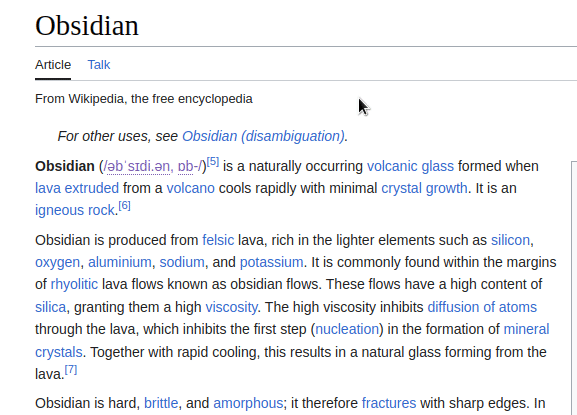
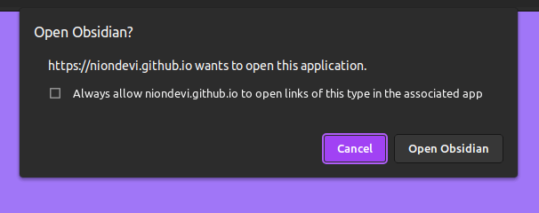

# Clipsidian

A Chrome extension that lets you capture in-browser content and send it directly to your Obsidian vault

  

  
Clipsidian is a Chrome extension that streamlines the process of collecting web content for [Obsidian](https://obsidian.md/). 

With Clipsidian, you can easily extract crucial information from web pages and store it directly into your Obsidian vault. This extension goes beyond basic web clipping by allowing the configuration of multiple clipping actions, allowing you to control where in your vaults each clipped web content is stored. 

With customizable templates you can include additional details like date, time, page title, and URL with each saved web clipping, for rapid data collection in multiple contexts.

## Installation

For manual installation please follow these steps:

1. Clone or download the Clipsidian GitHub repository to your local machine.
2. In your Chrome browser, navigate to chrome://extensions.
3. Enable Developer mode by clicking the toggle switch in the upper-right corner.
4. Click on Load unpacked and navigate to the directory where you have downloaded or cloned the Clipsidian repository.
5. Select the folder and click Open to install the extension.
6. Please note, extensions installed in Developer mode will not receive updates automatically. You'll need to manually pull new updates from the GitHub repository and reload the extension in your Chrome browser.

## How to Use

Visit the product page at [https://niondevi.github.io/clipsidian/](https://niondevi.github.io/clipsidian/) for more instructions.

### First Time Authorization (Obsidian URI)

  

For first-time users, you will need to authorize the page at https://niondevi.github.io/clipsidian/clip.htm to open Obsidian. This authorization is a necessary workaround due to how Chrome handles URI requests. Without this step, Chrome would require you to authorize each individual page from which you want to clip content, which can be inconvenient and time-consuming.

By authorizing this specific page, you enable it to handle all subsequent clips, thus avoiding repeated authorization requests. This authorization only happens once, streamlining your clipping process. When handling subsequent clips, any data (like the content to be clipped) that's passed as URL parameters to that page is not sent to a server but is instead handled entirely within your browser.

## Data Safety

Your data is secure and is only processed within your browser, even during the authorization workaround. We don't send, track, or store any of your details. If you still have any doubts, you or someone you trust could always take a look at the code, just to make sure everything's clear. As an open-source project, we believe in full transparency.

  

## Contributing

We welcome contributions to Clipsidian! 

If you like the project and want to contribute, you can support us on [Patreon](https://www.patreon.com/niondevi) or [Ko-fi](https://ko-fi.com/niondevi).

## Support

For any issues, feature requests, or questions, please open an [issue](https://github.com/niondevi/clipsidian/issues).

## Acknowledgements

Thanks to [Luxon](https://github.com/moment/luxon) for providing the date/time formatting and [turndown](https://github.com/mixmark-io/turndown) for the Markdown conversion.

## License

This project is licensed under the GPLv3 License. For more details, see the LICENSE file in the repository.