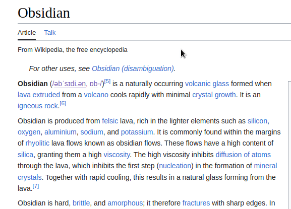

# Clipsidian

  
Clipsidian is a Chrome extension that streamlines the process of collecting web content for [Obsidian](https://obsidian.md/), a powerful knowledge base that works on top of a local folder of plain text Markdown files. With Clipsidian, you can easily extract crucial information from web pages and store it directly into your Obsidian vault. This extension goes beyond basic web clipping by offering customization for each action, allowing you to decide where the content is stored, its format, and include additional details like date, time, page title, and URL.

## Installation

For manual installation please follow these steps:

1. Clone or download the Clipsidian GitHub repository to your local machine.
2. In your Chrome browser, navigate to chrome://extensions.
3. Enable Developer mode by clicking the toggle switch in the upper-right corner.
4. Click on Load unpacked and navigate to the directory where you have downloaded or cloned the Clipsidian repository.
5. Select the folder and click Open to install the extension.
6. Please note, extensions installed in Developer mode will not receive updates automatically. You'll need to manually pull new updates from the GitHub repository and reload the extension in your Chrome browser.

  
## How to Use

To use Clipsidian, follow these steps:

1. **Configure your actions**: Open the Clipsidian extension options in your Chrome browser and set up your clipping actions.
2. **Highlight the content**: In your web browser, select the content you want to add to your Obsidian vault.
3. **Access the context menu**: Right-click on the highlighted content.
4. **Select the relevant action**: From the context menu, select an action. Obsidian should open (if it isn't already open) and your clipping should be saved!

### First Time Authorization (Obsidian URI)

For first-time users, you will need to authorize the page at https://niondevi.github.io/clipsidian/new.htm to open Obsidian. This authorization is a necessary workaround due to how Chrome handles URI requests. Without this step, Chrome would require you to authorize each individual page from which you want to clip content, which can be inconvenient and time-consuming.

By authorizing this specific page, you enable it to handle all subsequent clips, thus avoiding repeated authorization requests. This authorization only happens once, streamlining your clipping process. When handling subsequent clips, any data (like the content to be clipped) that's passed as URL parameters to that page is not sent to a server but is instead handled entirely within your browser.

### Configuring Clipping Actions

Each clipping action can be configured with the following options:

**Action Name**
The name of the action for easy identification.

**Vault**
The name of your Obsidian vault where the clip will be stored.

**Target Note Path**
The full path of the note in your Obsidian vault where the clip will be saved. This path can be dynamically formatted using the placeholders `{title}`, `{date}`, and `{time}`. 

	Example:  `Web Clippings/{date:MM}`

**Clipping Template**
The template used to format the clipped content. This markdown template supports the placeholders `{clip}`, `{title}`, `{url}`, `{date}`, and `{time}`.

	Example:  `> {clip} [{title}]({url})`

You can also choose the **behavior of the clipping action**:

- **Append to note**: The clip will be appended to the existing note at the specified path.
- **Overwrite note**: The existing note at the specified path will be overwritten with the new clip.

#### Date and Time Formatting

The `date` and `time` placeholders in the clipping template can be customized to match your preference by using [moment's](https://momentjs.com/docs/#/displaying/format/) date and time formatting. The placeholders can be used in the following ways:

- `{date}`: Displays the current date in `YYYY-MM-DD` format.
- `{date:FORMAT}`: Displays the current date in the specified format.
	- Example: `{date:MMM Do, YYYY}` -> `January 1st, 2000`
- `{time}`: Displays the current time in `HH:mm:ss` format.
- `{time:FORMAT}`: Displays the current time in the specified format.
	- Example: `{time:hh:mm A}` -> `12:34 AM`

#### Locale

You can also set the locale for date and time formatting in your own language in the extension options.

## Data Safety

Your data is secure and is only processed within your browser, even during the authorization workaround. We don't send, track, or store any of your details. If you still have any doubts, you or someone you trust could always take a look at the code, just to make sure everything's clear. As an open-source project, we believe in full transparency.

## Support

For any issues, feature requests, or questions, please open an issue on our [GitHub repository](https://github.com/niondevi/clipsidian).

## Contributing

We welcome contributions to Clipsidian! If you like the project and want to contribute, you can support us on [GitHub](https://github.com/clipsidian/extension), [Patreon](https://www.patreon.com/niondevi), or [Ko-fi](https://ko-fi.com/niondevi).

## Acknowledgements

Thanks to [moment.js](https://github.com/moment/moment) for providing the date/time formatting and [turndown](https://github.com/mixmark-io/turndown) for the Markdown conversion.

## License

This project is licensed under the GPLv3 License. For more details, see the LICENSE file in the repository.